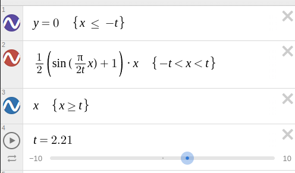
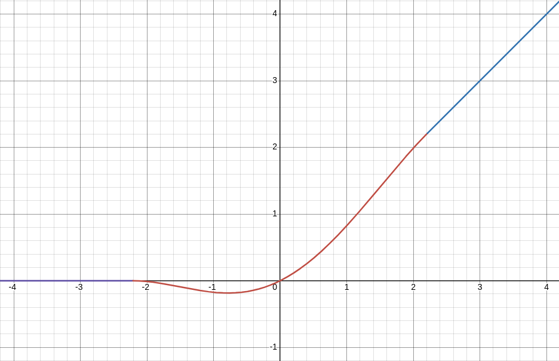
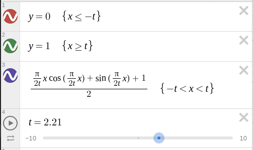
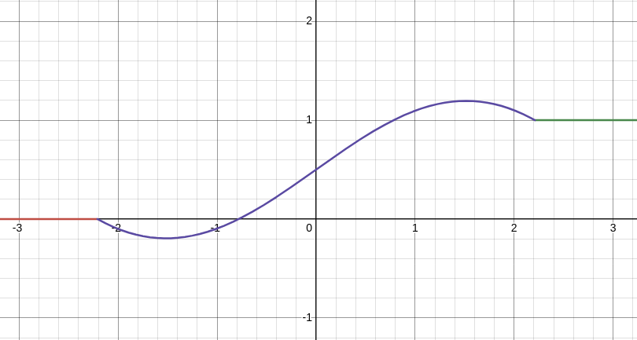
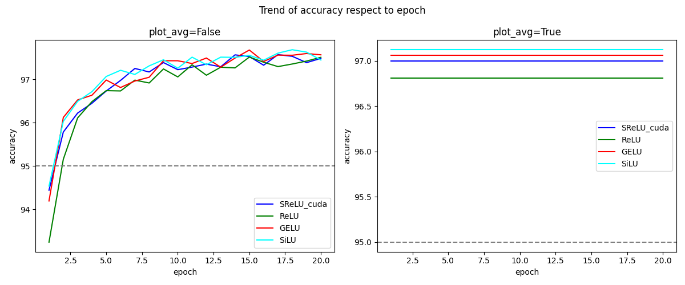
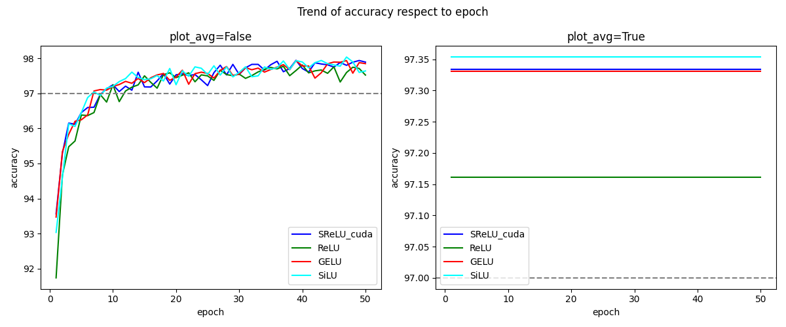

# SReLU Activation Function

## Introduction
The SReLU (`Sinusoidal Rectified Linear Unit`) is a novel activation function designed for neural networks that combines characteristics of the popular ReLU, GELU, and Swish activation functions while ensuring continuity and differentiability across its domain. This activation function aims to provide a balance between linear and non-linear responses, adapting to the data's nature and thus potentially improving learning dynamics in deep neural networks.

## Features
- **Continuity and Differentiability**: Unlike some traditional activation functions, SReLU is designed to be smooth and differentiable across its entire domain, which can help in optimizing gradient-based learning methods.
- **Adaptive Responses**: The function adjusts its behavior across different ranges of the input, incorporating both linear and sinusoidal components. This hybrid approach allows it to manage the vanishing and exploding gradients problem more effectively.
- **Nonlinear Transformation Capability**: SReLU introduces the sine function, which adds additional nonlinearity and enhances the network's expressive capability. Unlike ReLU, which truncates negative values to zero, SReLU retains some nonlinear transformation on the negative half-axis.
- **Flexibility with Parameter `t`**: The introduction of the parameter `t` provides additional flexibility, allowing SReLU to adapt to some extent to different tasks and data characteristics. Choosing an appropriate value for `t` may lead to improved performance.
- **Retaining Optimizability of ReLU**: SReLU exhibits a ReLU-like linear response within a certain range, inheriting ReLU's optimization efficiency.
- **Ease of Integration**: SReLU can be easily integrated into existing neural network architectures as a drop-in replacement for other activation functions.

## Activation Function Definition
The SReLU activation function can be defined as follows:

```
f(x) = 0    , if x <= -t;
f(x) = 1/2 * (sin((pi/2t) * x) + 1) * x    , if -t < x < t;
f(x) = x    , if x >= t;
```

Python code:

```python
import numpy as np

def SReLU(x, t=2):
    a = (np.pi / 2) / t
    return np.where(x <= -t, 0, np.where(x < t, x * (np.sin(a * x) + 1) / 2, x))
```



### Parameters:
- `x`: Input tensor.
- `t`: Threshold parameter that delineates the three distinct segments of the activation function: inputs less than `-t`, between `-t` and `t`, and greater than `t`. The optimized value is 2.21

## Derivative of SReLU
The derivative of SReLU is crucial for backpropagation in neural networks. It is defined as:

```python
def SReLU_derivative(x, t=2):
    a = (np.pi / 2) / t
    return np.where(x <= -t, 0, np.where(x < t, a * x * np.cos(a * x) / 2 + np.sin(a * x) / 2 + 1 / 2, 1))
```



### Parameters:
- `x`: Input tensor.
- `t`: Threshold parameter that delineates the three distinct segments of the activation function: inputs less than `-t`, between `-t` and `t`, and greater than `t`. The optimized value is `t=2.21`

## Usage
To use the SReLU function in your neural network models, simply replace the activation function in the model's layer definitions with `SReLU`. The SReLU_cuda version is recommended, you can use it after compile(see `./native/INSTALL.md`).

## Performance Evaluation: 
### Comparison with Existing Activations: 
Performance comparative studies vs. ReLU, GELU, Swish activation

#### Evaluation1: mnist on 3-Layer MLP

```
# Performance evaluation use simple MLP as below

class Net(nn.Module):
    def __init__(self, activation_func):
        super(Net, self).__init__()
        self.fc1 = nn.Linear(784, 128)
        self.fc2 = nn.Linear(128, 64)
        self.fc3 = nn.Linear(64, 10)
        self.activation = activation_func

    def forward(self, x):
        x = x.view(-1, 784)
        x = self.activation(self.fc1(x))
        x = self.activation(self.fc2(x))
        x = self.fc3(x)
        return torch.log_softmax(x, dim=1)

criterion = nn.CrossEntropyLoss()
optimizer = optim.AdamW(model.parameters(), lr=1e-3, weight_decay=1e-4)
```

##### 20Epochs x 10 training & evaluate activations of SReLU_cuda vs. nn.RELU, nn.GELU, nn.SiLU 

```
Activation: SReLU_cuda    Mean: 97.0001  Mean(>10Epochs): 97.4344   Std(>10Epochs): 0.0134
Activation: ReLU          Mean: 96.8088  Mean(>10Epochs): 97.3493   Std(>10Epochs): 0.0155
Activation: GELU          Mean: 97.0593  Mean(>10Epochs): 97.5024   Std(>10Epochs): 0.0140
Activation: SiLU          Mean: 97.1233  Mean(>10Epochs): 97.5257   Std(>10Epochs): 0.0102
```
##### 50Epochs x 10 training & evaluate activations of SReLU_cuda vs. nn.RELU, nn.GELU, nn.SiLU 

```
Activation: SReLU_cuda    Mean: 97.3337  Mean(>25Epochs): 97.7727   Std(>25Epochs): 0.0152
Activation: ReLU          Mean: 97.1613  Mean(>25Epochs): 97.6056   Std(>25Epochs): 0.0158
Activation: GELU          Mean: 97.3307  Mean(>25Epochs): 97.7181   Std(>25Epochs): 0.0217
Activation: SiLU          Mean: 97.3537  Mean(>25Epochs): 97.7446   Std(>25Epochs): 0.0246
```

#### Evaluation2: cifar10 airbench
Performance evaluation use cifar10-airbench:
Training methods for CIFAR-10 with state-of-the-art speed. https://github.com/KellerJordan/cifar10-airbench

```
25 rounds with cifar10 airbench94 evaluation
Activation: SReLU_cuda    Mean: 0.9408    Std: 0.0014  (1st)
Activation: ReLU          Mean: 0.9368    Std: 0.0013
Activation: GELU          Mean: 0.9400    Std: 0.0011
Activation: SiLU          Mean: 0.9394    Std: 0.0013

25 rounds with cifar10 airbench95 evaluation
Activation: SReLU_cuda    Mean: 0.9502    Std: 0.0011  (2nd)
Activation: ReLU          Mean: 0.9478    Std: 0.0011
Activation: GELU          Mean: 0.9507    Std: 0.0014  (1st)
Activation: SiLU          Mean: 0.9499    Std: 0.0013

10 rounds with cifar10 airbench96 evaluation
Activation: SReLU_cuda    Mean: 0.9603    Std: 0.0013  (≈1st)
Activation: ReLU          Mean: 0.9583    Std: 0.0012
Activation: GELU          Mean: 0.9603    Std: 0.0013
Activation: SiLU          Mean: 0.9604    Std: 0.0013
```
Comparative analysis reveals that SReLU not only slightly surpasses ReLU in mean accuracy but also closely competes with GELU and SiLU. This underlines its effectiveness in both rapid initial learning and sustained high performance in later training stages, making SReLU a viable choice for models requiring balanced and stable activation dynamics throughout extended training regimes. The graphical trends further corroborate SReLU's robustness in maintaining high accuracy levels, solidifying its position as a strong contender among activation functions.

## Theoretical Analysis:
### Mathematical Computational Complexity

#### SReLU (Sinusoidal Rectified Linear Activation Unit):
- **Nature**: SReLU is a piecewise function that includes 2 simple linear part and a nonlinear part involving a sine function.
- **Complexity**: The computation of the sine function involves trigonometric operations, which are generally more computationally intensive than basic arithmetic operations (addition, subtraction, multiplication, division) on traditional CPUs. However, modern hardware, such as GPUs, often have optimizations that make trigonometric calculations more efficient.

#### GELU (Gaussian Error Linear Unit):
- **Nature**: GELU requires the computation of the Gaussian cumulative distribution function, Φ(x), typically implemented using the error function (erf), which is a composite function involving exponential calculations.
- **Complexity**: The computation of the error function is usually more complex than basic trigonometric calculations, particularly in implementations that are not optimized. The involvement of exponential functions adds to its computational overhead, which can be significant without specific hardware or software optimizations.

#### Swish:
- **Nature**: Swish involves the sigmoid function, which requires exponential calculations.
- **Complexity**: Despite involving exponential calculations, the sigmoid function is widely used in various applications, such as logistic regression, leading to its highly optimized implementation in modern computational libraries. This optimization generally mitigates the overhead associated with its exponential nature.

- **Complexity Ranking**: Theoretically, computational complexity GELU > SReLU ≈ Swish

## Conclusion
SReLU (Sinusoidal Rectified Linear Activation Unit) represents an innovative approach to activation functions in neural networks, blending linear and nonlinear transformations effectively. SReLU achieves performance comparable to GELU while requiring lower computational resources, making it more efficient. Moreover, it shares a similar computational complexity with Swish but typically delivers superior performance. This balance of computational efficiency and effectiveness not only encourages further exploration and adoption within the machine learning community but also offers practical advantages. 

Activation function `Sinusoidal Recified Linear Unit`
